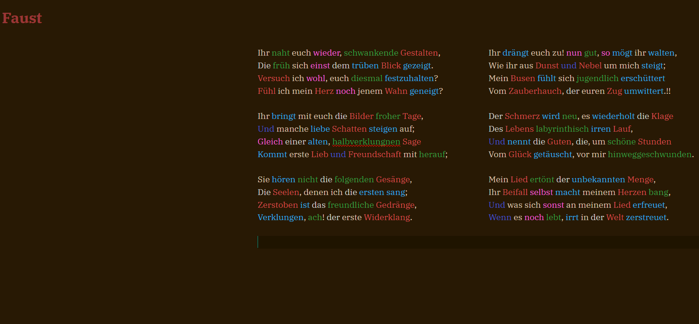
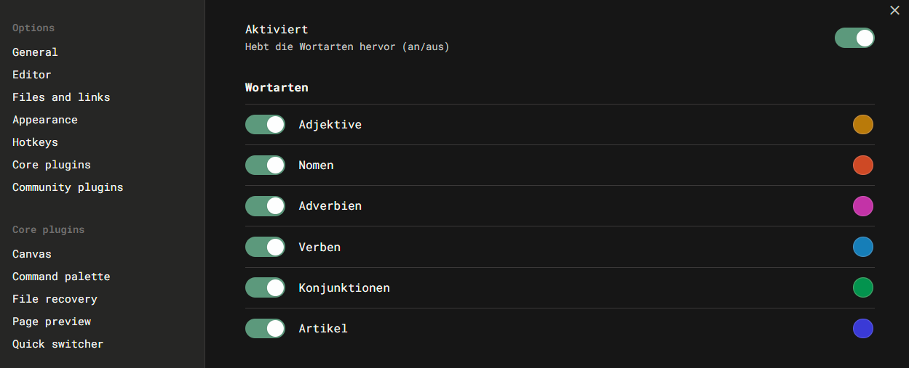

# Natural Language Syntax Highlighting

**This is a fork of the original Natural Language Syntax Highlighting plugin, adapted to work with German text as well as English.**

This version uses the [de-compromise](https://github.com/nlp-compromise/de-compromise) library for German language support, instead of the original [compromise](https://github.com/spencermountain/compromise) library for English.

A plugin for [Obsidian.md](https://obsidian.md/) that highlights adjectives, nouns, adverbs, verbs, articles, and conjunctions in the editor. Inspired by iA Writer.

Colours can be customised in the plugin settings.

The highlighting can be toggled on or off at any time via the command **Natural Language Syntax Highlighting: Toggle on/off** in the Command palette.

## Installation

1. Download the latest release assets from the [Releases page](https://github.com/your-username/nl-syntax-highlighting/releases).
2. Unzip the downloaded folder.
3. Move the unzipped folder into your vault's `.obsidian/plugins` directory.
4. Restart Obsidian or enable the plugin from the Obsidian settings under "Community plugins".

## Contributing

Any contributions and PRs are welcome.

## Acknowledgements

Thanks to [artisticat](https://github.com/artisticat1) for the original plugin, this is simply
a fork to add German language support.